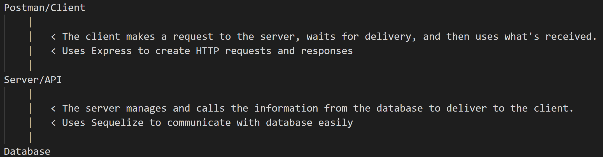
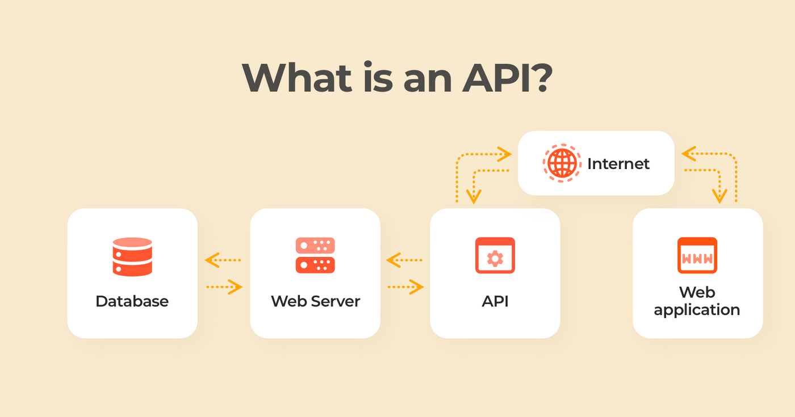

# Introduction to Servers

- To build a full stack application we require both a back(server) and front(client) end.
- Servers are a way for our client side (front end) interaction to communicate with databases.
- Instead of storing logic on the client side to handle functionality or certain checks (like user login, etc.) we send a request through a server to handle the request and response for us.
  - This adds security so only we can dictate the allowed routes/pathways. We determine what users can do/create/edit/delete/etc.

A.k.a. : Node.js is an open source server environment, allows us to write server-side applications that executes JavaScript code outside a web browser.

We will be using **Express** to build an Express App server.

# Express

A web framework for Node.js

- Node.js: an open-source, cross-platform JavaScript runtime environment and library for running web applications outside the client's browser
- Node.js can be used to write both back and front end code, thus can be used to construct servers
- Node.js is like a car engine, you still need to gather the parts and put the vehicle together. ExpressJS is like a pre-built car you can hop in and start driving.

### [Express](https://expressjs.com/):

- Express is a minimal and flexible Node.js web application framework that provides a robust set of features for web and mobile applications.
- With a myriad of HTTP utility methods and middleware at your disposal, creating a robust API is quick and easy.

A.k.a. : Express is a back end application framework for Node.js, provides server-side logic for applications to allow
routing and processing of HTTP requests.

This allows us to create our own routes and endpoints to perform CRUD functionalities:

- Create, POST, [.post()](https://expressjs.com/en/4x/api.html#app.post.method)
- Read, GET, [.get()](https://expressjs.com/en/4x/api.html#app.get)
- Update, PUT, [.put()](https://expressjs.com/en/4x/api.html#app.put.method)
- Delete, DELETE, [.delete()](https://expressjs.com/en/4x/api.html#app.delete.method)

# Project Set Up

1. In terminal within Project folder run command: `npm init -y`

- This is telling the Node Package Manager(NPM) to install(init) with all the base default options for a project (-y || --yes)
- You will see a lot happening and find a new file in your project called package-lock.json and a folder called node_modules

2. Next we install our needed dependencies in the same terminal.

- To install Express we run the command: `npm i express`
- Node Package Manager(npm) install(i) express

3. We will create a file within our project (the traditional way in VSC) titled: `.gitignore`

- In the gitignore file we will add: `/node_modules`
- This tells our local repository to ignore the node_modules folder when we push and backup our code to GitHub

---

What does it all mean??

The Flow with Words:

The Flow in Pictures:

# Project Set Up

1. In terminal within Project folder run command: `npm init -y`

- This is telling the Node Package Manager(NPM) to install(init) with all the base default options for a project (-y || --yes)
- You will see a lot happening and find a new file in your project called package-lock.json and a folder called node_modules

2. Next we install our needed dependencies in the same terminal.

- To install Express we run the command: `npm i express`
- Node Package Manager(npm) install(i) express
- Brings in our node_modules and package-lock.json

3. We will create a file within our project (the traditional way in VSC) titled: `.gitignore`

- In the gitignore file we will add: `/node_modules`
- This tells our local repository to ignore the node_modules folder when we push and backup our code to GitHub
- When cloning down a project that ignores items: run the command "npm install" to acquire all files needed/dependencies

---

What does it all mean??

The Flow with Words:

The Flow in Pictures:

<!--  -->

## API vs. Server

We've talked about APIs and Servers in a general sense a lot together.
To be clear:

- An API and the Server are two different things
- An API is an Application Programming Interface, which is a way to provide information for other applications (communication among applications, ex. the front end web page can communicate with the server).
- An API provides access to the server.
- A server is an application that's locally saved in your system, even a physical device.
https://github.com/burlingtoncodeacademy-students/PT_SD_January23_LectureNotes/blob/main/Unit_5/GeneralNotes/assets/rest-api-model.png
https://github.com/burlingtoncodeacademy-students/PT_SD_January23_LectureNotes/blob/main/Unit_5/GeneralNotes/assets/API.png

### Visual Examples:

